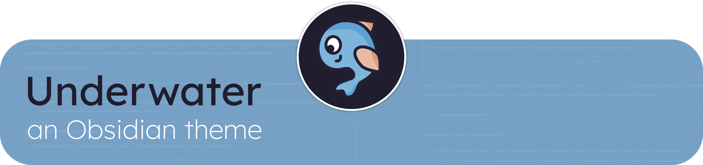
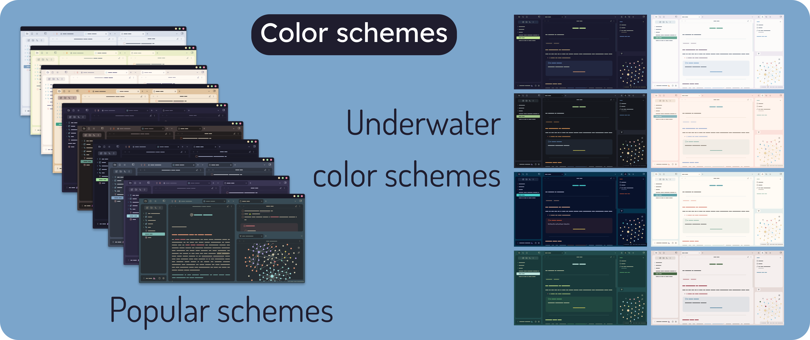
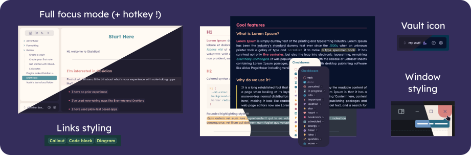

> ### Recent features ✨
> - 🎨 New color schemes: 🌊 _Underwater Sand_ (dark) and 🌊 _Underwater Coral_ (light)
> - 🎨 New color scheme: _Obsidian_ (light and dark) using the default colors of the app!
> - 🖼️ Custom background image (+ image blur, image opacity, and layout opacity)

> [!IMPORTANT]
> 🐳 This theme works best with the **[Style Settings](https://github.com/mgmeyers/obsidian-style-settings) plugin**, which allows you to choose a **color scheme**, to customize all of the **colors** and to choose alternate **stylings**.

---

# Color schemes

<table align="center">
    <thead>
        <tr>
            <th colspan="2">Popular color schemes</th>
            <th colspan="2">🌊 Underwater color schemes</th>
        </tr>
    </thead>
    <tbody align="center">
        <tr>
            <td><b>Light</b></td>
            <td><b>Dark</b></td>
            <td><b>Light</b></td>
            <td><b>Dark</b></td>
        </tr>
        <tr>
            <td>Nord</td>
            <td>Nord</td>
            <td>Octopus</td>
            <td>Deep๋࣭</td>
        </tr>
        <tr>
            <td>Catppuccin Latte</td>
            <td>Catppuccin Mocha</td>
            <td>Coral</td>
            <td>Blue Ocean</td>
        </tr>
        <tr>
            <td>Everforest</td>
            <td>Everforest</td>
            <td></td>
            <td>Seaweed</td>
        </tr>
        <tr>
            <td>Gruvbox</td>
            <td>Biscuit</td>
            <td></td>
            <td>Sand</td>
        </tr>
        <tr>
            <td>Rosé Pine Dawn</td>
            <td>Rosé Pine</td>
            <td></td>
            <td></td>
        </tr>
        <tr>
            <td></td>
            <td>Rosé Pine Moon</td>
            <td></td>
            <td></td        </tr>
        <tr>
            <td>Obsidian default</td>
            <td>Obsidian default</td>
            <td></td>
            <td></td>
        </tr>
    </tbody>
</table>

# Cssclasses

- **no-title**: removes inline title
- **no-embed**: seamless embeds
- **notebook**: adds notebook-like background to current note
- **write**: monospace font + bigger first letter for each paragraph

# Formatting
**🌅 Nice fonts:**
- Text font: [Lexend](https://www.lexend.com/)
- Interface font: [Inter](https://rsms.me/inter/)
- Monospace font: [Recursive Monospace](https://www.recursive.design/) or [Recursive Monospace Casual](https://www.recursive.design/)

- Checkboxes
- Custom callouts: timeline, person, bookmark, media + "center" callout metadata
- Scrollbar on hover (credit to [Border](https://github.com/Akifyss/obsidian-border) theme)
- Active line highlight
- Slight image animation on hover
- Special window styling (best suited for Windows)
- Rounded highlighting style + internal links special style
- New tab custom image & styling
- FULL FOCUS MODE (can be toggled via a hotkey)
- VAULT ICON (icon can be chosen via Style settings)
- Background image

    
✅ Click to see <b>checkboxes</b>

    

        <table>
    <tr>
        <td><pre>
- [ ] task 
- [x] done
- [-] canceled
- [/] in progress
- [i] info
- [!] important
- [l] location
- [*] star
- [H] heart
- [b] bookmark
- [<] scheduled
- [e] energy
- [T] timer
- [I] idea
- [s] sparkles
- [w] wave</pre></td>
        <td>
</td>
    </tr>
</table>

# Plugins support

- Make.MD
- Kanban
- Pomodoro timer
- Calendar
- Widgets
- Tokei
- File Tree Alternative
- Todoist Sync
- Wypst

# Credit
Credit to these themes for certain elements and inspiration!
- [Border](https://github.com/Akifyss/obsidian-border) by [@Akifyss](https://github.com/Akifyss)
- [AnuPpuccin](https://github.com/AnubisNekhet/AnuPpuccin) by [@Anubis](https://github.com/AnubisNekhet)
- [Minimal](https://github.com/kepano/obsidian-minimal) by [@Kepano](https://github.com/kepano)
- Default tab image by [karyative](https://www.flaticon.com/fr/auteurs/karyative) on [Flaticon](https://www.flaticon.com/).

# Tasks
- [x] Add more options for settings with style settings
- [x] Work on README
- [x] Add custom color schemes
- [x] Submit theme
- [ ] 📱 Mobile support
