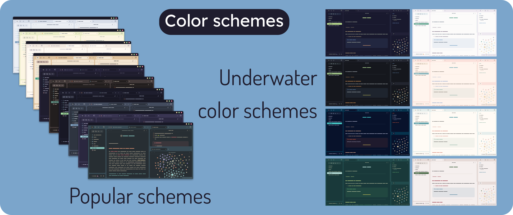

↪️ [Updates](https://github.com/Seniblue/Underwater/releases)

 

# Underwater for Obsidian
_✨ Runner up in the Obsidian [Gems of the Year 2024](https://obsidian.md/blog/2024-goty-winners/) awards!_

 

> [!IMPORTANT]
> 🐳 This theme works best with the **[Style Settings](https://github.com/mgmeyers/obsidian-style-settings) plugin** (color schemes, custom colors, customizations, features, background image...). 
> _Although the plugin is not required for the theme to work._
---

## 🎨 Color schemes

### Popular color schemes
| Dark                                                | Light                                               |
| --------------------------------------------------- | --------------------------------------------------- |
| [Rosé Pine](https://rosepinetheme.com/)             | [Rosé Pine Dawn](https://rosepinetheme.com/)             |
| [Rosé Pine Moon](https://rosepinetheme.com/)        |                                                     |
| [Nord](https://www.nordtheme.com/)                  | [Nord](https://www.nordtheme.com/)                  |
| [Catpuccin Mocha](https://catppuccin.com/)          | [Catpuccin Latte](https://catppuccin.com/)          |
| [Everforest](https://github.com/sainnhe/everforest) | [Everforest](https://github.com/sainnhe/everforest) |
| [Biscuit](https://github.com/Biscuit-Theme/biscuit) | [Gruvbox](https://github.com/morhetz/gruvbox)       |
| Obsidian default                                    | Obsidian default                                    |

### 🌊 Underwater color schemes
| Dark       | Light   |
| ---------- | ------- |
| Deep       | Octopus |
| Blue ocean | Coral   |
| Seaweed    | Aqua    |
| Sand       | Oyster  |

## Formatting
**🪼 Recommended fonts:**
- Text font: [Lexend](https://www.lexend.com/)
- Interface font: [Inter](https://rsms.me/inter/)
- Monospace font: [Recursive Monospace](https://www.recursive.design/) or [Recursive Monospace Casual](https://www.recursive.design/)

## Cssclasses

- **`no-title`**: removes inline title
- **`no-embed`**: seamless embeds
- **`notebook`**: adds notebook-like background to current note
- **`write`**: monospace font + bigger first letter at the beginning of each paragraph
- **`cloze`**: hidden bold text, revealed on hover (reading view only)

## ✨ Features
- Custom checkboxes
- Custom callouts: `time`, `person`, `bookmark`, `media` and `box` + "`center`" metadata
- Scrollbar on hover (credit to [Border](https://github.com/Akifyss/obsidian-border) theme)
- Active line highlight
- Slight image animation on hover
- Rounded highlighting style
- New tab custom image & styling
- FULL FOCUS MODE (can be toggled via a hotkey)
- VAULT ICON (icon can be chosen via Style settings)
- Custom background image
- Print styling

## Snippets

[🐠 Snippets folder](https://github.com/Seniblue/Underwater/tree/main/%F0%9F%90%A0%20SNIPPETS) featuring:
- [🌊 Minimal_cards](https://github.com/Seniblue/Underwater/blob/main/%F0%9F%90%A0%20SNIPPETS/%F0%9F%8C%8A%20Minimal_cards.css) (modified version of [@Kepano](https://github.com/kepano)'s minimal cards.)
-   [🚩 Timeline callout](https://github.com/Seniblue/Underwater/blob/main/%F0%9F%90%A0%20SNIPPETS/%F0%9F%9A%A9%20Timeline%20callout.css) (tweaked from [@FireIsGood](https://discord.com/channels/686053708261228577/702656734631821413/1156868388249935883)'s timeline callout)

## 🧩 Plugins support

- [Kanban](https://github.com/mgmeyers/obsidian-kanban)
- [Pomodoro timer](https://github.com/eatgrass/obsidian-pomodoro-timer)
- [Calendar](https://github.com/liamcain/obsidian-calendar-plugin)
- [Widgets](https://github.com/rafaelveiga/obsidian-widgets)
- [Tokei](https://github.com/ms3056/Tokei)
- [Todoist Sync](https://github.com/jamiebrynes7/obsidian-todoist-plugin)
- [Make.MD](https://github.com/Make-md/makemd)
- [File Tree Alternative](https://github.com/ozntel/file-tree-alternative)
- [Wypst](https://github.com/0xpapercut/obsidian-wypst)
- [Dataview](https://github.com/blacksmithgu/obsidian-dataview)
- [Meta Bind](https://github.com/mProjectsCode/obsidian-meta-bind-plugin)
- [Cardboard](https://github.com/roovo/obsidian-card-board)
- [Task Genius](https://github.com/Quorafind/Obsidian-Task-Genius)

## Credit
Credit to these themes for some elements and inspiration!
- [Border](https://github.com/Akifyss/obsidian-border) by [@Akifyss](https://github.com/Akifyss)
- [AnuPpuccin](https://github.com/AnubisNekhet/AnuPpuccin) by [@Anubis](https://github.com/AnubisNekhet)
- [Minimal](https://github.com/kepano/obsidian-minimal) by [@Kepano](https://github.com/kepano)
- The Obsidian [Forum](https://forum.obsidian.md/)

## Tasks
- [x] Add more settings
- [x] Work on README
- [x] Add custom color schemes
- [x] 📱 Mobile support
- [x] RTL support

---

💫 Feel free to star the theme on github if you enjoy it!
