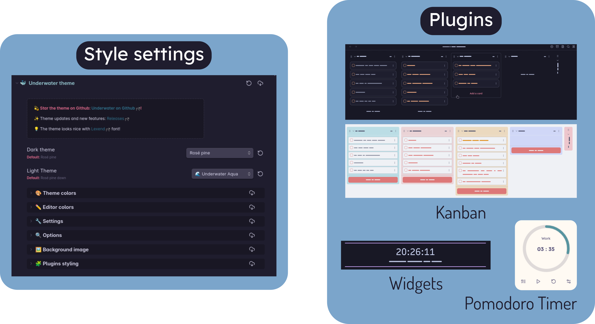

> [!IMPORTANT]
> 🐳 This theme works best with the **[Style Settings](https://github.com/mgmeyers/obsidian-style-settings) plugin**, which allows you to choose a **colorscheme**, to customize all of the **colors** or to choose alternate stylings.

---

# Colorschemes

| Light | Dark |
| :------------------: | :-----------------: |
| Nord               | Nord              |
| Catpuccin Latte    | Catpuccin Mocha   |
| Everforest         | Everforest         |
| Biscuit            | Biscuit           |
| Rosé pine dawn     | Rosé pine         |
|                    | Rosé pine moon    |

# Cssclasses
- **No-title** : removes inline title
- **Notebook** : adds notebook-like background image to current note
- **Write** : monospace font + bigger first letter for each paragraph

# Formatting
- Font : [Lexend](https://www.lexend.com/)

- Scrollbar on hover (credit to [Border](https://github.com/Akifyss/obsidian-border) theme)
- Outline pane ([Maple](https://github.com/subframe7536/obsidian-theme-maple) theme)
- Active line coloring
- Cursor color
- Slight image animation on hover
- Special window styling (better for Windows)
- Rounded highlighting style + internal links special style
- New tab custom image & styling
- FULL FOCUS MODE (can be toggled via a hotkey)
- VAULT ICON (icon can be chosen via Style settings)

# Plugins support

- Make.MD
- Kanban
- Pomodoro timer
- Calendar
- Widgets
- Tokei
- File Tree Alternative
- Todoist Sync
- Wypst

# Credit
Credit to these themes for certain elements and inspiration
- [Border](https://github.com/Akifyss/obsidian-border)
- [AnuPpuccin](https://github.com/AnubisNekhet/AnuPpuccin)
- [Minimal](https://github.com/kepano/obsidian-minimal)

# Tasks
- [ ] Work on README
- [ ] Add custom color schemes
- [x] Add more options for settings with style settings
- [ ] Submit theme to obsidian theme list
