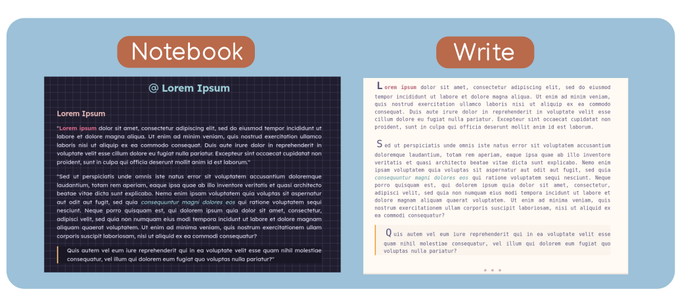
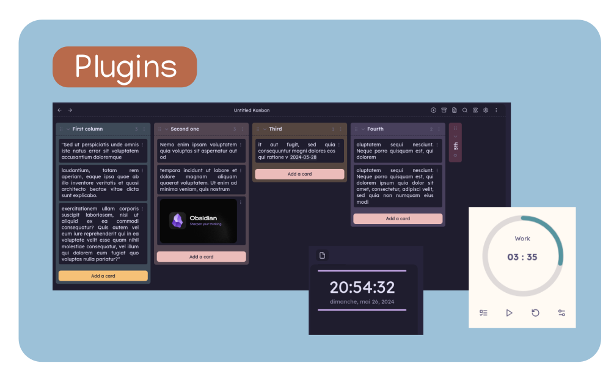

> [!IMPORTANT]
> This theme works best with the [Style Settings](https://github.com/mgmeyers/obsidian-style-settings) plugin, which allows you to choose a colorscheme and even to customize **all** the theme colors.

---

# Colorschemes

| Light colorschemes | Dark colorschemes |
| ------------------ | ----------------- |
| Nord               | Nord              |
| Catpuccin Latte    | Catpuccin Mocha   |
| Rosé pine dawn     | Rosé pine         |
|                    | Rosé pine moon    |

# Cssclasses
- **No-title** : removes inline title
- **Notebook** : adds notebook-like background image to current note
- **Write** : monospace font + bigger first letter for each paragraph
- **Print** : formats your note so you can export it to pdf properly

# Formatting
- Font : [Lexend](https://www.lexend.com/)

- Hover line indicator (credit to [Border](https://github.com/Akifyss/obsidian-border) theme)
- Small scrollbar (credit to [Border](https://github.com/Akifyss/obsidian-border) theme)
- Outline hover indicator ([Maple](https://github.com/subframe7536/obsidian-theme-maple) theme)
- Active line coloring
- Cursor color
- Image slight animation on hover
- Special window styling on Windows
- Rounded highlighting style + internal links special style

# Plugins support

- Make.MD
- Kanban
- Pomodoro timer
- Calendar
- Widgets
- Tokei

# Credit
Credit to these themes for certain elements and inspiration
- [Border](https://github.com/Akifyss/obsidian-border)
- [AnuPpuccin](https://github.com/AnubisNekhet/AnuPpuccin)
- [Minimal](https://github.com/kepano/obsidian-minimal)

# Tasks
- [ ] Add more color schemes
- [ ] Add more options for settings with style settings
- [ ] ...
